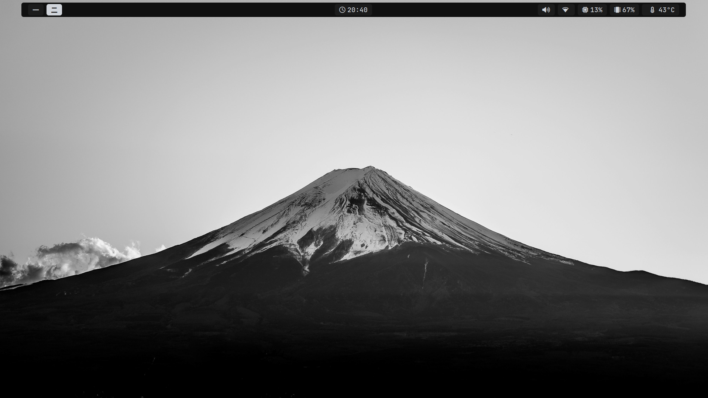
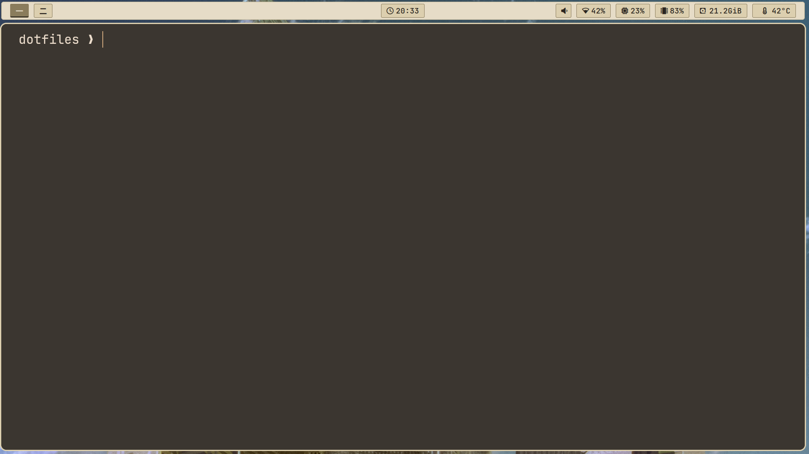
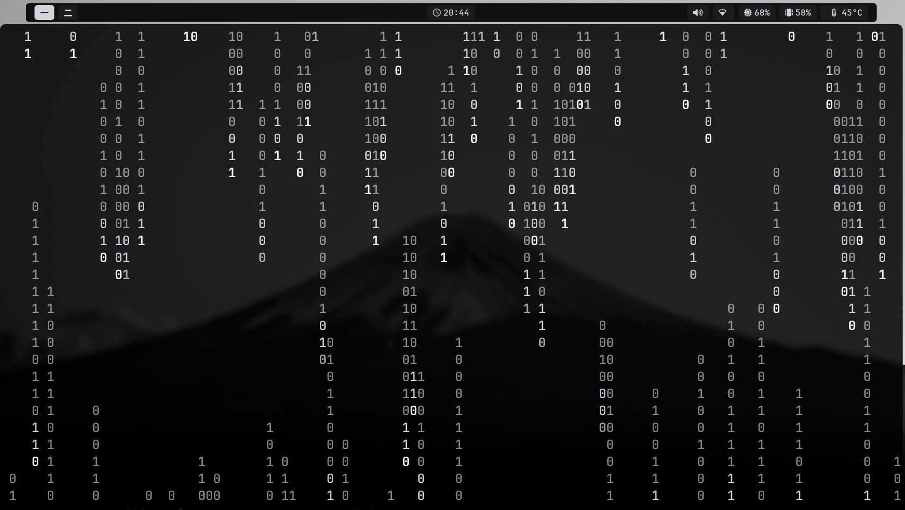

# The Cyber-Scientific Sanctuary (Arch/Niri Dotfiles)

> "Science isn't magic. It's simply what happens when you stop using the mouse like a caveman."

Welcome to my configuration repository. Here lies the proof that human patience is finite, but the capacity to customize Arch Linux is infinite. This is not merely a collection of `.conf` files — it's the scientific blueprint for elite-level efficiency.

> **Inspired by:** [diinki/linux-retroism](https://github.com/diinki/linux-retroism.git) — full credit to the original vision that sparked this setup.

---
> **Desktop**


> **Terminal Preview**


> **Terminal(Matrix)**


## 🛠️ Laboratory Components — Quick Diagnostic

| Module | Description | Importance Level |
| :--- | :--- | :--- |
| **Niri** | Infinite scroll guided by pure physics. Windows on a continuous strip — pure mathematical logic. | 10,000,000,000% |
| **Waybar** | A status bar so clean it would make a microscope feel inadequate. | Absurd |
| **Neovim** | The throne of development (Node/C++/PostgreSQL). If you use conventional VS Code, I mourn for your primitive soul. | Vital |
| **Fuzzel** | The definitive dmenu-mode launcher on Wayland. Fast, minimalist, and integrated with Cliphist for absolute clipboard control. | Superior |
| **Yazi** | The definitive CLI file manager for the Arch Linux ecosystem. | Supreme |
| **ZSH + Core** | Pure-blood shell. Customized via script for phosphor-green TTY, `zstyle` completion, and infinite FZF-powered history. | Absurd |
| **Kitty** | Emulador de terminal acelerado por GPU. Configurado sob medida com fundo sólido bege Metropolis, rastro de cursor dinâmico e tipografia JetBrainsMono milimetricamente calibrada para erradicar o cansaço visual. | Absurd |

## 🚀 Scientific Protocol — Installation

If you're a promising lab colleague, you know scripts aren't magic. Rebuilding the world happens through the terminal:

**1. Clone this repository:**
```bash
git clone https://github.com/Helder-Maneco/Config.niri.git ~/dotfiles
```
